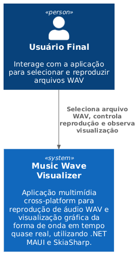
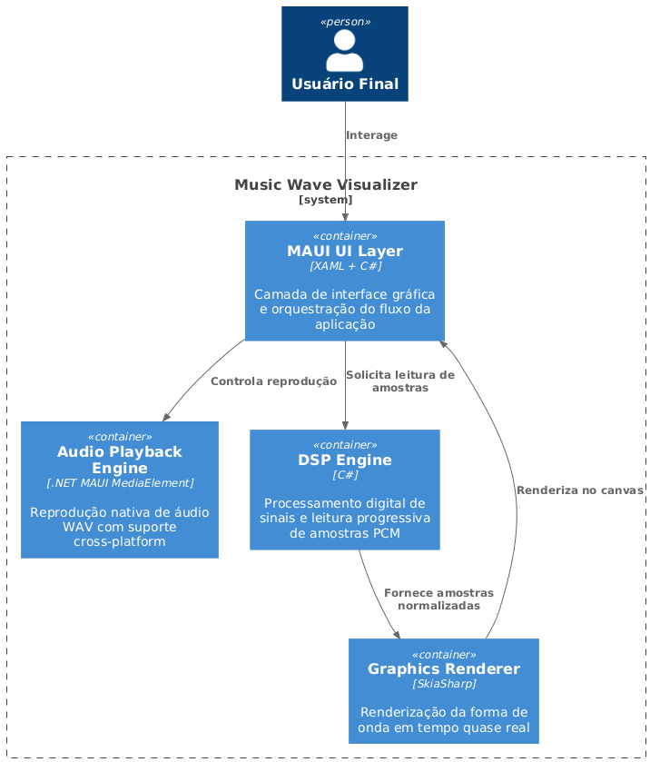
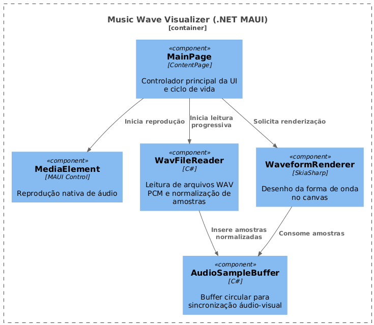
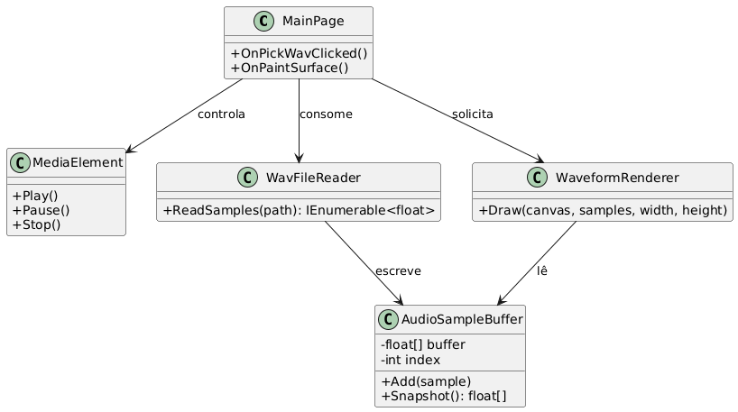

# Music Wave Visualizer

Visualização Gráfica de Áudio em Tempo Quase Real com .NET MAUI

## 1. Introdução

### 1.1 Contextualização

Aplicações multimídia interativas ocupam um papel relevante no desenvolvimento de sistemas modernos, especialmente em domínios que envolvem processamento de sinais, computação gráfica e interfaces homem-máquina. A visualização de áudio em tempo quase real é amplamente utilizada em áreas como engenharia de som, análise de sinais e softwares musicais, permitindo ao usuário compreender propriedades temporais e estruturais do sinal sonoro.

O projeto **Music Wave Visualizer** insere-se nesse contexto como uma aplicação experimental voltada à exploração da sincronização entre reprodução de áudio e renderização gráfica, utilizando tecnologias modernas do ecossistema .NET.

---

### 1.2 Objetivos

#### 1.2.1 Objetivo Geral

Desenvolver uma aplicação cross-platform utilizando .NET MAUI (.NET 10) capaz de reproduzir arquivos de áudio no formato WAV e renderizar dinamicamente sua forma de onda de maneira sincronizada.

#### 1.2.2 Objetivos Específicos

- Implementar leitura incremental de amostras de áudio.
- Projetar um buffer circular eficiente para visualização contínua.
- Integrar renderização gráfica utilizando SkiaSharp.
- Separar responsabilidades entre interface gráfica, domínio de áudio e infraestrutura.
- Documentar a arquitetura do sistema utilizando o modelo C4.

---

## 2. Metodologia

### 2.1 Abordagem Metodológica

A metodologia adotada é de caráter experimental e exploratório, com foco no desenvolvimento incremental e na validação contínua de decisões arquiteturais. O projeto foi conduzido por meio de ciclos curtos de implementação, análise e refatoração, priorizando clareza arquitetural e extensibilidade.

---

### 2.2 Tecnologias Utilizadas

#### 2.2.1 Plataforma e Linguagem

- .NET 10
- C# 14
- .NET MAUI (Multi-platform App UI)

#### 2.2.2 Bibliotecas e Frameworks

- SkiaSharp para renderização gráfica
- APIs nativas de reprodução de áudio por meio de abstrações próprias
- FilePicker do .NET MAUI para seleção de arquivos

---

## 3. Análise Arquitetural

### 3.1 Visão Geral da Arquitetura

A aplicação foi projetada segundo princípios de baixo acoplamento e alta coesão, adotando uma estrutura modular que separa claramente as responsabilidades de interface, domínio e infraestrutura. Essa organização facilita manutenção, testes e evolução futura do sistema.

---

### 3.2 Modelo C4

A documentação arquitetural do projeto **Music Wave Visualizer** adota o **Modelo C4**, proposto por Simon Brown, com o objetivo de representar a arquitetura do sistema em diferentes níveis de abstração. Essa abordagem facilita a compreensão progressiva da solução, desde a visão mais ampla do sistema até o detalhamento de seus componentes internos.

---

#### 3.2.1 Diagrama de Contexto (C1)

O diagrama de contexto apresenta o **Music Wave Visualizer** como uma aplicação standalone que interage diretamente com o usuário final. O sistema acessa recursos locais do dispositivo, como o sistema de arquivos para seleção de arquivos WAV e APIs nativas para reprodução de áudio. Não há dependências externas ou integrações com serviços remotos, caracterizando uma solução autocontida.

---

#### 3.2.2 Diagrama de Contêineres (C2)

O diagrama de contêineres detalha a decomposição interna da aplicação, evidenciando os principais blocos funcionais que compõem o sistema. A aplicação é organizada em contêineres lógicos que representam:

- Interface gráfica desenvolvida com .NET MAUI.
- Módulo de reprodução de áudio, responsável pelo controle de playback.
- Módulo de leitura e processamento de amostras de áudio.
- Módulo de renderização gráfica da forma de onda.

Esses contêineres comunicam-se de forma síncrona, respeitando limites claros de responsabilidade.

---

#### 3.2.3 Diagrama de Componentes (C3)

O diagrama de componentes apresenta a estrutura interna de cada contêiner, detalhando os principais componentes de software e suas interações. Destacam-se:

- Componentes de interface responsáveis por eventos de usuário e atualização da tela.
- Componentes de domínio de áudio, incluindo leitores de arquivos WAV e buffers de amostras.
- Componentes de renderização, responsáveis por transformar dados numéricos em representações gráficas.
- Interfaces de abstração que isolam dependências específicas de plataforma.

Essa organização favorece baixo acoplamento e facilita a substituição ou extensão de funcionalidades.

---

#### 3.2.4 Diagrama de Código (C4)

O diagrama de código descreve a organização das classes, interfaces e estruturas de dados que compõem o sistema. Nesse nível, são evidenciadas:

- Classes responsáveis pelo gerenciamento do buffer de amostras de áudio.
- Interfaces para controle de reprodução e encerramento da aplicação.
- Classes de renderização gráfica que operam diretamente sobre o canvas.
- Relacionamentos de dependência e composição entre os elementos.

O detalhamento em nível C4 fornece subsídios para análise de manutenibilidade, extensibilidade e qualidade estrutural do código-fonte.

---

## 4. Desenvolvimento

### 4.1 Estrutura do Projeto

A solução está organizada em módulos que refletem responsabilidades bem definidas:

- Camada de Interface (UI): páginas MAUI e interação com o usuário.
- Camada de Domínio de Áudio: leitura de arquivos WAV, buffers e controle de playback.
- Camada de Renderização: lógica de desenho da forma de onda.
- Camada de Infraestrutura: abstrações dependentes de plataforma.

---

### 4.2 Buffer de Amostras de Áudio

O sistema utiliza um buffer circular para armazenamento das amostras de áudio. Essa estrutura permite escrita contínua de dados em background e leitura simultânea pela thread de interface gráfica, garantindo fluidez visual sem crescimento descontrolado de memória.

---

### 4.3 Renderização da Forma de Onda

A renderização gráfica é realizada por meio do componente `SKCanvasView`, com invalidação periódica baseada em um temporizador. Cada frame reflete o estado atual do buffer de amostras, produzindo uma visualização contínua do sinal de áudio no domínio do tempo.

---

### 4.4 Controle de Reprodução

A aplicação suporta carregamento de arquivos WAV, reprodução automática, pausa, retomada e interrupção da execução. O controle de playback é desacoplado da interface por meio de interfaces, garantindo portabilidade e extensibilidade.

---

## 5. Resultados

### 5.1 Resultados Funcionais

- Reprodução correta de arquivos WAV.
- Visualização gráfica contínua da forma de onda.
- Sincronização satisfatória entre áudio e visualização.
- Execução cross-platform em diferentes sistemas operacionais.

---

### 5.2 Resultados Arquiteturais

- Código modular e extensível.
- Separação clara de responsabilidades.
- Facilidade de manutenção e evolução do sistema.
- Base arquitetural adequada para experimentos futuros.

---

## 6. Limitações e Desafios

### 6.1 Limitações

- A visualização atual é restrita ao domínio do tempo.
- Não há análise espectral (FFT).
- A sincronização áudio–visual é aproximada, baseada em temporização e não em timestamps exatos do player.

---

### 6.2 Desafios Técnicos

- Diferenças entre APIs nativas de áudio em cada plataforma.
- Gerenciamento de concorrência entre threads de áudio e interface.
- Compatibilidade de bibliotecas com versões recentes do .NET MAUI.

---

## 7. Trabalhos Futuros

### 7.1 Melhorias Funcionais

- Implementação de FFT e espectrograma.
- Modos alternativos de visualização gráfica.
- Controles avançados de playback e navegação temporal.

---

### 7.2 Melhorias Arquiteturais

- Sincronização baseada no tempo real do player.
- Introdução de padrões de projeto para controle de estados.
- Extração do domínio de áudio como biblioteca reutilizável.
- Implementação de testes automatizados.

---

## 8. Conclusão

O projeto Music Wave Visualizer demonstra a viabilidade do uso do .NET MAUI para aplicações multimídia interativas, conciliando reprodução de áudio, visualização gráfica e organização arquitetural sólida. A solução desenvolvida serve tanto como experimento técnico quanto como base para estudos mais avançados em processamento de sinais e computação gráfica.
